# GDD - Game Design Document - Módulo 1 - Inteli

## Preserverance Games

<a href="https://pixabay.com/music/acoustic-group-acoustic-folk-music-guitar-141345/">David Deodato</a>, <a href="https://pixabay.com/music/acoustic-group-acoustic-folk-music-guitar-141345/">Igor Sampaio</a>, <a href="https://pixabay.com/music/acoustic-group-acoustic-folk-music-guitar-141345/">Marlos Guedes</a>, <a href="https://pixabay.com/music/acoustic-group-acoustic-folk-music-guitar-141345/">Otávio Vasconcelos</a>, <a href="https://pixabay.com/music/acoustic-group-acoustic-folk-music-guitar-141345/">Raphael Silva</a>, <a href="https://pixabay.com/music/acoustic-group-acoustic-folk-music-guitar-141345/">Ricardo Planas</a> e <a href="https://pixabay.com/music/acoustic-group-acoustic-folk-music-guitar-141345/">Thiago Volcati</a>

## Sumário

[1. Introdução](#c1)

[2. Visão Geral do Jogo](#c2)

[3. Game Design](#c3)

[4. Desenvolvimento do jogo](#c4)

[5. Casos de Teste](#c5)

[6. Conclusões e trabalhos futuros](#c6)

[7. Referências](#c7)

[Anexos](#c8)

 

# 1. Introdução (sprints 1 e 4)

## 1.1. Escopo do Projeto

### 1.1.1. Contexto da indústria (sprints 1 e 4)

&nbsp;&nbsp;&nbsp;&nbsp;Unilever é uma empresa multinacional que possui mais de 400 marcas em mais de 190 países ao redor do mundo e está presente na vida de mais de 3,4 bilhões de pessoas com seus produtos diariamente. Essa indústria é uma das maiores no segmento de bens de consumo no mundo, possuindo cinco vertentes no mercado: alimentação, limpeza, produtos de higiene e produtos de cuidados pessoais. Entre as principais marcas estão: Omo, Dove, Doriana, Kibon, Hellmann 's, Rexona, Knorr-Cica, Lipton, Magnum, Comfort. Contudo, há corporações  multinacionais nesse ramo que competem o pódio, como a Procter & Gamble e a Nestlé.

### 1.1.2. Análise SWOT (sprints 1 e 4)

&nbsp;&nbsp;&nbsp;&nbsp;A análise SWOT é relacionada ao parceiro Unilever, a tabela foi feita a fim de realizar uma avaliação ambiental no âmbito estratégico, levando em consideração o contexto da indústria, ocorrências e as características do ambiente interno e externo da Unilever.

Figura 1 - Análise SWOT

Fonte: Material produzido pelos autores (2024)

### 1.1.3. Descrição da Solução Desenvolvida (sprints 1 e 4)

&nbsp;&nbsp;&nbsp;&nbsp;A Unilever, apesar de sua posição como empresa líder global, identificou defasagens em seu processo de onboarding, notada na baixa absorção de informações críticas pelos novos colaboradores. A proposta de solução almeja reformular e gamificar o onboarding, incorporando elementos lúdicos para tornar a aprendizagem envolvente e significativa. 
A solução proposta será utilizada como uma ferramenta interativa e dinâmica, apresentando-se na forma de um jogo personalizado destinado a envolver ativamente os novos membros da empresa. Os benefícios almejados incluem aumento na retenção de informações, uma compreensão mais profunda da empresa e um alinhamento eficaz com os valores e objetivos da Unilever. O critério de sucesso será medido através de análises periódicas de desempenho, satisfação e engajamento, visando proporcionar uma transição positiva para o ambiente de trabalho da Unilever.

### 1.1.4. Proposta de Valor (sprints 1 e 4)

&nbsp;&nbsp;&nbsp;&nbsp;A proposta de valor descreve aspectos essenciais para criação de valor para o projeto, traçando o objetivo de melhor entender a realidade do parceiro e entregar uma solução alinhada com o que a Unilever espera.

Figura 2 - Proposta de Valor
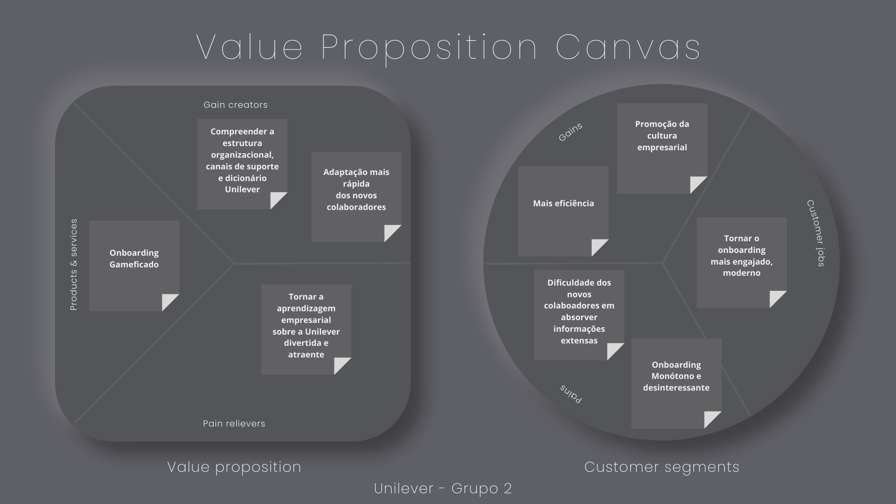
Fonte: Material produzido pelos autores (2024)

### 1.1.5. Matriz de Riscos (sprints 1 e 4)

&nbsp;&nbsp;&nbsp;&nbsp;A matriz de risco demonstra os riscos observados no projeto pela equipe de desenvolvimento, representando ameaças e oportunidades, assim como impactos relevantes sobre o projeto. Em verde, estão indicados percalços que não necessitam de intervenção; em amarelo, pontos que apresentam média probabilidade e demandam certa atenção; e, em vermelho, estão destacados pontos críticos que devem ser evitados.

Figura 3 - Matriz de Riscos

Fonte: Material produzido pelos autores (2024)

## 1.2. Requisitos do Projeto (sprints 1 e 2)

\# | Requisito
--- | ---
1 | Recompensas por responder perguntas relacionadas à Unilever 
2 | Os controles serão: seta cima, esquerda, baixo, direita, Q W e E
3 | HUB de direcionamento para trilhas específicas de Onboarding da Unilever
4 | Apresentação de informações públicas da empresa de forma gamificada
5 | O jogo será em 2D de plataforma
6 | Apresentação das mecânicas do Onboarding
7 | Mostrar o dicionário da Unilever
8 | O personagem perde uma vida toda vez que toca em um inimigo ou em algum projétil inimigo
9 | Mecânica de utilização de poderes
10 | Mundo lúdico - estilo Mario
11 | Realização de quiz
12 | Contato com plataformas Unilever (Uniops & degreed)
13 | Mecânica de dash

## 1.3. Público-alvo do Projeto (sprint 2)

Nosso público alvo são pessoas com perfil médio de estagiários na Unilever, na faixa etária média de 24 anos, com formação acadêmica conectada à área de tecnologia

# 2. Visão Geral do Jogo (sprint 2)

## 2.1. Objetivos do Jogo (sprint 2)

&nbsp;&nbsp;&nbsp;&nbsp;O jogador precisa derrotar inimigos pelo mapa, concluir os quizzes e derrotar o chefão da fase, nas duas cenas de combate. Desse modo, o jogador será capaz de concluir o jogo integralmente. Conforme solicitado, nenhuma das partes anteriormente citadas será uma barreira para o colaborador completar o processo de integração.

## 2.2. Características do Jogo (sprint 2)

### 2.2.1. Gênero do Jogo (sprint 2)

&nbsp;&nbsp;&nbsp;&nbsp;O gênero do jogo é de plataforma e aventura. O gênero de plataforma consiste em movimentar seu personagem através do ambiente no qual jogo acontece. O Gênero de aventura, por sua vez, são jogos nos quais o jogador assume o lugar de protagonista e tem como objetivo explorar o ambiente interativamente e concluir quebra-cabeças.

### 2.2.2. Plataforma do Jogo (sprint 2)

&nbsp;&nbsp;&nbsp;&nbsp;O jogo é feito para Desktop e será jogado na plataforma Web. Como indicado pelo termo de abertura do projeto e reafirmado pelos parceiros durante as sprints, a opção pela plataforma web desktop está mais alinhada com a proposta e objetivos definidos para o projeto.

### 2.2.3. Número de jogadores (sprint 2)

&nbsp;&nbsp;&nbsp;&nbsp;Devido a indicação do parceiro e, as limitações provenientes das escolhas pela plataforma web e sem ligação com os servidores da empresa, o jogo será individual, por buscando salientar o desenvolvimento individual de cada colaborador.

### 2.2.4. Títulos semelhantes e inspirações (sprint 2)

&nbsp;&nbsp;&nbsp;&nbsp;Entre as inspirações para o jogo, pode-se listar Sonic, Mario e Mega Man. As escolhas decorrem do fato de que os jogos citados pertencem aos mesmos gêneros do jogo criado, tendo como base a movimentação em duas dimensões, arte em pixel e a temática de aventura. Além disso, os jogos em questão revolucionaram suas época ao trazer inovação, originalidade, simplicidade e valores igualmente desenvolvidos neste projeto.

### 2.2.5. Tempo estimado de jogo (sprint 5)

*Ex. O jogo pode ser concluído em 3 horas passando por todas as fases.*

*Ex. cada partida dura até 15 minutos*

# 3. Game Design (sprints 2 e 3)

## 3.1. Enredo do Jogo (sprints 2 e 3)

&nbsp;&nbsp;&nbsp;&nbsp;Você acorda, está se preparando para o primeiro dia na Unilever, mas nota algo diferente, o mundo está imerso em um ambiente mágico, onde a harmonia é mantida pela energia vital da natureza balanceada pela Unilever. No entanto, este equilíbrio está sendo abalado pois as principais marcas foram roubadas por vilões tenebrosos, e agora você precisa batalhar com eles para recuperar e restaurar o equílibro. Os vilões por trás disso tudo são o "Rei da Poluição" e o "Rei do Desmatamento". Estes vilões, acompanhados por seus monstros, espalham o caos, sujeira e a destruição, poluindo e destruindo os belos cenários naturais e ameaçando a vida de todas as criaturas mágicas que habitam esse mundo, incluindo a sua. E agora? Devolva as marcas para Unilver para salvar o mundo?

&nbsp;&nbsp;&nbsp;&nbsp;Cena 0 - Tela de Título
Descrição: Tela simples de título com botão play, configurações e som.

&nbsp;&nbsp;&nbsp;&nbsp;Cena 1 - Seletor de personagem

&nbsp;&nbsp;&nbsp;&nbsp;Tela simples para que o jogador selecione seu personagem.

&nbsp;&nbsp;&nbsp;&nbsp;Cena 2 - Quarto

&nbsp;&nbsp;&nbsp;&nbsp;Descrição: Quarto do personagem com um PC e um Rexona (Power-up) interativo.

&nbsp;&nbsp;&nbsp;&nbsp;O personagem irá acordar em seu aconchegante quarto, tendo como objetivo interagir com o computador. No dispositivo, ele será apresentado ao Microsoft Teams, onde sua diretora o dará a missão de recuperar as marcas e lhe dará uma das marcas que sobraram para ajuda-lo em sua caminhada.

&nbsp;&nbsp;&nbsp;&nbsp;Fala da diretora:

'Diretora: Olá, colaborador, seja bem vindo a Unilever!',
'Diretora: aqui na Unilever utilizamos o Microsoft Teams como principal forma de comunicação remota.',
'Diretora: Vilões tenebrosos roubaram algumas de nossas marcas, e por conta disso, não estamos mais conseguindo manter o equilíbrio da Unilever.',
'Diretora: Iremos te enviar uma das nossas marcas para você conseguir enfrentar os desafios a frente sem nem suar'
'Diretora: Contamos com você, herói, ajude-nos a recuperar nossas marcas e reestruturar a empresa'

&nbsp;&nbsp;&nbsp;&nbsp;Em seguida, o personagem seguirá pela cena e deverá interagir com o Rexona.

&nbsp;&nbsp;&nbsp;&nbsp;Iniciará o diálogo:
 
'Parabéns, você conseguiu o power-up do Super Rexona!',
'Para utilizar seus novos poderes utilize a tecla Q'

&nbsp;&nbsp;&nbsp;&nbsp;Cena 3 - Cenário combate 1

&nbsp;&nbsp;&nbsp;&nbsp;O personagem sai do quarto e se depara com um mundo lúdico estilo Super Mario. Para avançar na fase, ele deve seguir para direita e derrotar os inimigos com o poder do Rexona. Ao longo da fase, estarão espalhados 2 NPCs que são obrigatórios para prosseguir na fase. Quando o jogador interagir com eles, terá acesso aos links disponibilizados pela Unilever, e só poderá prosseguir no jogo após clicar nos links oferecidos pelos NPCs. No caminho, também estarão disponíveis 3 pontos de interação não obrigatórios (que serão lixos a serem coletados), ao interagir com eles, aparecerá no topo da tela quantos desses você interagiu, (exemplo: ⅓), caso o personagem interaja com todos eles ocorrerá o seguinte diálogo com a diretora:

Uau! Você foi além e recolheu todo o lixo que encontrou pelo caminho. Receba uma bonificação pelo seu ato de valor!
(nesse momento o personagem receberá uma bonificação, uma vida extra).

&nbsp;&nbsp;&nbsp;&nbsp;Perto do fim da fase, haverá um quiz no computador, que também servirá como checkpoint, caso ele acerte o quiz, receberá um aumento de poder, caso perca, nada acontecerá, e ele poderá prosseguir na fase e enfrentar o boss “Rei da poluição”. Caso ele perca para o rei, poderá retornar a fase onde está o quiz, e poderá refazê-lo caso não tenha acertado da última vez, assim, enfrentará novamente o boss quantas vezes forem necessárias. Caso ganhe do boss, ele deverá soltar um item um “Omo”, ao personagem interagir com o item, ele se tornará o “SUPER OMO”, e o diretora aparecerá novamente com o seguinte diálogo:

Nossa! Sempre soube que você era capaz. Você derrotou o rei da poluição, mas ainda há muito por vir. Continue no caminho para Unilever e você encontrará o rei do desmatamento, com seus novos poderes, você será capaz de derrotá-lo.

&nbsp;&nbsp;&nbsp;&nbsp;Para finalizar a fase terá um botão na janela de diálogo com a diretora escrito “Seguir para próxima fase”

&nbsp;&nbsp;&nbsp;&nbsp;Cena 4 - Exploração urbana combate 2

&nbsp;&nbsp;&nbsp;&nbsp;Agora o personagem se encotra em um cenário urbano e acabado. No início, a assistente de jogo do personagem o ensinará como utilizar a mecânica “dash”. Para avançar na fase, ele deve seguir para direita e derrotar os inimigos com o poder do OMO, utilizando todas as mecânicas de movimentação necessárias. Ao longo da fase, estarão espalhados 2 NPCs que são obrigatórios para prosseguir na fase. Quando o jogador interagir com eles, terá acesso aos links disponibilizados pela Unilever, e só poderá prosseguir no jogo após clicar nos links oferecidos pelos NPCs. Ao longo da fase também estarão disponíveis 3 pontos de interação não obrigatórios (que serão árvores a serem plantadas), ao interagir com eles, aparecerá no topo da tela quantos desses você interagiu (exemplo: ⅓), caso o personagem interaja com todos, ocorrerá o seguinte diálogo com a diretora:

Uau! Você foi além e plantou árvores pelo caminho. Receba uma bonificação pelo seu ato de valor!
(nesse momento o personagem receberá uma bonificação, de preferência uma vida extra).

&nbsp;&nbsp;&nbsp;&nbsp;Perto do fim da fase, haverá um quiz que o NPC te fornecerá, que também servirá como checkpoint, caso o jogador acerte o quiz, receberá um aumento de poder. Caso erre, nada acontecerá, e ele poderá prosseguir na fase e enfrentar o boss “Rei do desmatamento”. Caso ele perca pro rei, irá retornar a seção onde está o quiz, e poderá refazê-lo caso não tenha acertado da última vez, assim, enfrentará novamente o boss quantas vezes forem necessárias. Caso ele ganhe do chefe, o boss deverá soltar o item “Kibon” e a chave de acesso a Unilever, ao interagir com o item, o personagem ganhará novos poderes, Se tornando o "Super Kibon" e então deverá se iniciar o diálogo:

&nbsp;&nbsp;&nbsp;&nbsp;Eu sempre soube que você era capaz! Agora com seus novos poderes, vá direto para Unilever para consertarmos o planeta!
Para finalizar a fase basta interagir com uma placa desenhada no cenário escrito “U”, e assim, aparecerá uma janela escrita “Deseja utilizar a chave de entrada para Unilever?”, quando o funcionário apertar o botão “Sim”, a próxima fase se iniciará.

&nbsp;&nbsp;&nbsp;&nbsp;Cena 5 - Dentro da Unilever (cena final)

&nbsp;&nbsp;&nbsp;&nbsp;O personagem se encontra agora na Unilever.  No início, a assistente de jogo do personagem o ensinará como utilizar a mecânica “super dash”. Com esse power up da Kibon, o personagem deverá utilizar o super dash, e assim, avançar na fase, ele deve seguir para direita e avançar pelo terreno um pouco mais difícil agora.  Ao longo da fase, não terão NPCs, a fim de instigar dúvidas no jogador. Também não terão pontos de interação pelo mapa.

&nbsp;&nbsp;&nbsp;&nbsp;Perto do fim da fase, o jogador encontrará a diretora. Ao conversar com o NPC se iniciará o seguinte diálogo:

PARABÉNS! Você conseguiu derrotar todos os vilões e recuperar as nossas tão queridas marcas. Graças a você, conseguimos voltar a nossa força total e recuperar o equilíbrio do mundo. Seja bem vindo, herói, faça parte da nossa família Unilever.

&nbsp;&nbsp;&nbsp;&nbsp;A fase acaba com o personagem seguindo pelo cenário e encontrando um computador para interação no final do mapa. Neste computador quando ele interagir, reaparecerá a cena 0.

## 3.2. Personagens (sprints 2 e 3)

### 3.2.1. Controláveis

&nbsp;&nbsp;&nbsp;&nbsp;O jogo contará apenas com 1 personagem controlável que terá variações de gênero e etnia. O personagem não tem nome nem rosto, ele deverá representar o funcionário da Unilever, portanto possui forma humana e tem como objetivo seguir as instruções dadas ao longo do enredo da história. Ao longo do jogo, o personagem receberá poderes, que irão alterar suas roupas.

### 3.2.2. Non-Playable Characters (NPC)

&nbsp;&nbsp;&nbsp;&nbsp;O jogo contará com diversos NPCs pacíficos espalhados pelo mapa, que não terão nome, de acordo com o enredo serão apenas pessoas dispostas a ajudar o jogador. Ao interagir com os NPCs pacíficos, o personagem terá acesso a links e materiais sobre a Unilever. Ao longo do mapa terão 5 NPCs diferentes, com design parecido com o a seguir.

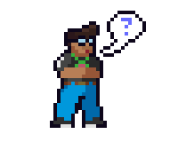

### 3.2.3. Diversidade e Representatividade dos Personagens

&nbsp;&nbsp;&nbsp;&nbsp;O jogo abordará a diversidade e representatividade dos personagens por meio de um sistema de seleção inicial no jogo, no qual o jogador poderá escolher o sprite de personagem com o qual ele se identifica. Tanto para os semblantes masculinos, quanto para os femininos, haveram 2 opções de etnia.

Figura 4 - Ilustração do ambiente Quarto

Fonte: Material produzido pelos autores (2024)

## 3.3. Mundo do jogo (sprints 2 e 3)

### 3.3.1. Locações Principais e/ou Mapas (sprints 2 e 3)

&nbsp;&nbsp;&nbsp;&nbsp;A cena inicial do jogo será no quarto, ambiente no qual é possível encontrar objetos como uma cama, guarda-roupas, mesa, janelas, um quadro e os itens principais deste ambiente: o desodorante Rexona e um notebook. O personagem irá acordar no ambiente em questão e irá interagir com um notebook que, dentro dele, encontrará informações sobre as plataformas que são utilizadas na empresa. No computador, após utilizar a ferramenta do Teams, entrará numa reunião onde receberá a missão de chegar a Unilever.

Figura 4 - Ilustração do ambiente Quarto
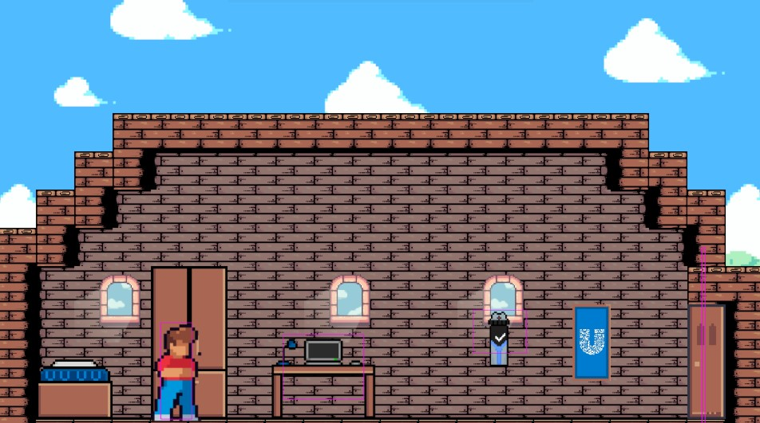
Fonte: Material produzido pelos autores (2024)

&nbsp;&nbsp;&nbsp;&nbsp;O segundo ambiente se encontra no Mundo Lúdico, onde o Player terá a primeira gameplay de fato do jogo, nessa fase, é possivel encontrar objetos de decoração relacionados à Unilever, será possível batalhar contra inimigos e no final da fase um "chefão". O objetivo do Player nessa fase é interagir com o NPC que disponibiliza dos Links de aprendizado da Unilever e depois interagir com o objeto de Quiz que lhe dará ou não o powerUp baseado no resultado. Depois de derrotar o primeiro chefe, pode seguir para o terceiro ambiente

Figura 5 - Ilustração do Mundo Lúdico

Fonte: Material produzido pelos autores (2024)
Figura 6 - Ilustração NPC do Hub de Links

Fonte: Material produzido pelos autores (2024)
Figura 7 - Ilustração do Hub de Links
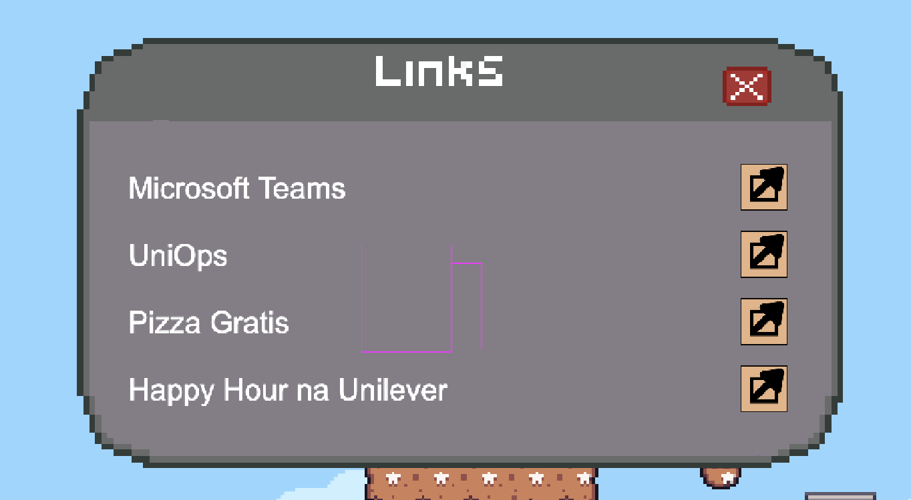
Fonte: Material produzido pelos autores (2024)

### 3.3.2. Navegação pelo mundo (sprints 2 e 3)

&nbsp;&nbsp;&nbsp;&nbsp;O personagem controlável tem a possibilidade de mover-se no eixo X, fazendo com que seja intuitivo a linearidade de avanço da história, cujo seguir para direita indica avanço. Ademais, o personagem tem a possibilidade de se deslocar no eixo Y, mas retornando sempre para o ponto inicial neste eixo após algum tempo, simulando uma mecânica de pulo. Além disso, as fases são desbloqueadas conforme conclusão dos objetivos de cada fase, que consiste em, até o momento, completar um quiz ou derrotar determinado inimigo. A progressão em questão acontece naturalmente, ao decorrer do jogo e sem grandes dificuldades para o jogador.

### 3.3.3. Condições climáticas e temporais (sprints 2 e 3)

&nbsp;&nbsp;&nbsp;&nbsp;O jogo apresentará algumas mudanças climáticas em cenários ao longo da experiência do usuário. O enredo e cenários da segunda cena foram projetados com um tempo ensolarado que permeia do início ao fim. Além disso, a passagem do tempo não possui influência no mundo do jogo, devido a pedido do próprio parceiro sobre a criação de poucas ou nenhuma limitaçõe para conclusão do onboarding.

### 3.3.4. Concept Art (sprint 2)

Concept art é a criação de imagens que representam ideias, personagens, ambientes e conceitos para produtos, ajudando a visualizar e desenvolver a direção criativa antes da produção completa.

Figura 8 - Arte Conceitual da Cena 2

Fonte: Material produzido pelos autores (2024)

Figura 8: Descrição dos objetos dispostos na primeira cena de combate, como plataformas, NPCs e coletáveis.

Figura 9 - Página de preload - Exemplo de modularização do código
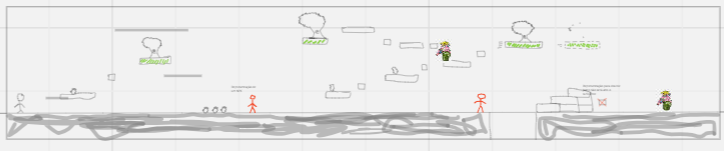
Fonte: Material produzido pelos autores (2024)

Figura 9: Descrição dos objetos dispostos na segunda cena de combate, como plataformas, NPCs e coletáveis.

### 3.3.5. Trilha sonora (sprint 3)

\# | título | ocorrência | autoria
--- | --- | --- | ---
1 | Pure Imaginaion | tela de início | - <a href="https://www.youtube.com/watch?v=tVzXp5ujQXw">Avery Mavery</a>
2 | Acoustic Folk Music Guitar | Level 1 (Quarto do Personagem) | <a href="https://pixabay.com/music/acoustic-group-acoustic-folk-music-guitar-141345/">Art Music</a>
3 | The Grand Score | Level 2 (Mundo Lúdico) | - <a href="https://www.chosic.com/download-audio/28030/">Alexander Nakarada</a>
4 | The Grand Score | Level 3 (Cidade Unilever) | - <a href="https://pixabay.com/music/solo-guitar-trip-to-home-relaxing-acoustic-guitar-background-music-7625/">Oleksii Kaplunskyi</a>

Licensas: https://mixkit.co/license/#sfxFree
## 3.4. Inventário e Bestiário (sprint 3)

### 3.4.1. Inventário

&nbsp;&nbsp;&nbsp;&nbsp;O inventário é constituído por todos os itens presentes dentro do jogo.

\# | item |  | como obter | função | efeito sonoro
--- | --- | --- | --- | --- | ---
1 | Rexona |  | ele pode ser obtido no início da cena 3 | aumentar a força do personagem | Não tem
2 | Omo | 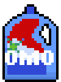 | ele pode ser obtido no final da cena 3 | aumentar a força do personagem | Não tem
3 | Kibon | 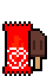 | ele pode ser obtido no final da cena 4 | aumentar a velocidade do personagem | Não tem
4 | Coração |  | ele pode ser obtido após acertar um quiz | representa a quantidade de vidas do personagem | Não tem

### 3.4.2. Bestiário
&nbsp;&nbsp;&nbsp;&nbsp;O bestiário é constituído por todos os inimigos presentes dentro do jogo.
\# | Inimigo |  | Ocorrências | Função | Impacto | Efeito sonoro
--- | --- | --- | --- | --- | --- | ---
1 | Slime verde | 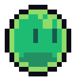 | Primeira cena de combate | Pula no chão em sua direção, com velocidade constante, tendo 2 de vida e 1 de dano por ataque e com o objetivo de atacar o personagem| Caso o jogador encoste no inimigo, o personagem perderá 1 ponto de vida | Som de slime 
2 | Slime roxo | 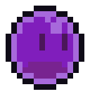 | Primeira cena de combate | Pula no chão em sua direção, com velocidade constante, tendo 3 de vida e 1 de dano por ataque e com o objetivo de atacar o personagem| Caso o jogador encoste no inimigo, o personagem perderá 1 ponto de vida | Som de slime
3 | Fumaçinha | 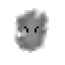 | Segunda cena de combate | Anda na direção do player e possui 2 de vida e 1 de dano| Caso o jogador encoste no projétil do inimigo, o personagem perderá 1 ponto de vida | Não tem
3 | Chefe Desmatamento | 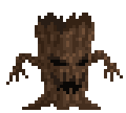 | No final do nível 2 | Anda na direção do player e possui 5 de vida e 2 de dano| Caso o jogador encoste no projétil do inimigo, o personagem perderá 2 ponto de vida | Não tem
3 | Rei da Poluição | 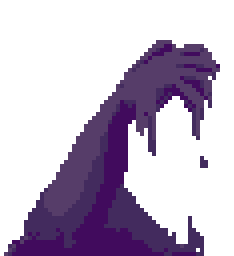 | No final do nível 3 | Anda na direção do player e possui 5 de vida e 2 de dano| Caso o jogador encoste no projétil do inimigo, o personagem perderá 2 ponto de vida | Não tem

## 3.5. Gameflow (Diagrama de cenas) (sprint 2)

&nbsp;&nbsp;&nbsp;&nbsp;Essa imagem apresenta um diagrama de fluxo de jogo para "UniWorld". Nele, encontramos várias cenas do jogo, diagramas de classe associados à programação orientada a objetos, e explicações sobre a progressão do jogador e suas interações. Aqui está uma explicação detalhada dos diferentes elementos:

&nbsp;&nbsp;&nbsp;&nbsp;Na cena inicial, quando o jogador inicia o jogo, é recebido com a tela inicial, oferecendo opções para jogar ("PLAY"), ajustar configurações ou silenciar o som. À esquerda, vemos um diagrama de classe intitulado "Tela de Título", que lista atributos e métodos como setInteractive() e preloadGame(), indicando que esta tela prepara o jogo para começar e configura elementos interativos.

&nbsp;&nbsp;&nbsp;&nbsp;Na cena de Seleção de Personagem, o jogador pode escolher seu personagem. O diagrama de classe associado é "Seleção de Jogador", com atributos como countdown e cloudCover, e métodos incluindo startGame() e setInteractive(). Nisso, vemos  a presença de um temporizador de contagem regressiva e uma animação como se fosse nuvens cobrindo os personagens antes da seleção.

&nbsp;&nbsp;&nbsp;&nbsp;No Mundo do Jogo, a área principal de jogabilidade, o jogador navega com o personagem pelo mundo, explorando, eliminando inimigos e superando obstáculos. O diagrama de classe inclui atributos como player e métodos como createPlayer(), createWorldLevel(), e vários outros que indicam funcionalidades para criar o nível, o personagem do jogador e a física do jogo.

&nbsp;&nbsp;&nbsp;&nbsp;Na cena do Quarto, o jogador está dentro de um quarto e deve interagir com um objeto, um item "Renona", para coletá-lo. O diagrama de classe é semelhante ao "Jogador no Mundo", mas inclui um método createMap(), sugerindo que esta cena envolve navegar em um espaço menor e fechado, como um mapa.

&nbsp;&nbsp;&nbsp;&nbsp;Cada cena é conectada por linhas vermelhas para a próxima, indicando o fluxo do jogo. O jogador começa na tela inicial, escolhe seu personagem, entra no mundo do jogo para navegar pelos níveis e interage com objetos em cenas específicas, como o quarto.

&nbsp;&nbsp;&nbsp;&nbsp;Esse tipo de diagrama é útil para os desenvolvedores de jogos planejarem a progressão do jogo, as classes e métodos necessários para implementar diferentes cenas do jogo, e para acompanhar como o jogador irá experimentar o jogo do início ao fim.

Figura 6 - Diagrama de Cenas
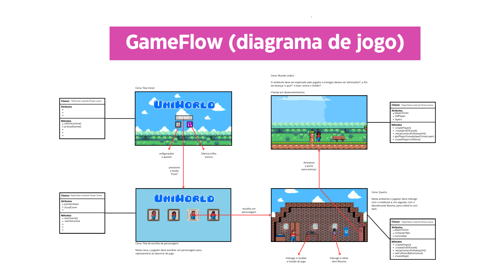
Fonte: Material produzido pelos autores (2024)

## 3.6. Regras do jogo (sprint 3)

&nbsp;&nbsp;&nbsp;&nbsp;O jogador deve concluir a fase, derrotando os inimigos, ganhando power ups e coletando os pedaços do logo da Unilever. Além disso, no final da fase, deve derrotar um boss e responder um quiz. Caso ele acerte o quiz, ele terá uma bonificação em alguma habilidade (força, alcance, velocidade...). Além disso, caso o jogador consiga formar a logo da Unilever espalhada pelo mapa, reunindo os pedaços, ele ganha uma vida extra.

## 3.7. Mecânicas do jogo (sprint 3)

&nbsp;&nbsp;&nbsp;&nbsp;No nosso jogo de plataforma 2D para computador, o jogador pode utilizar as teclas de seta do teclado para usar as mecânicas de se locomover e pular. Além disso caso o jogador pressione 2 vezes seguidas as teclas para cima o personagem irá dar um pulo duplo. Outra tecla importante para a jogabilidade proposta no nosso game é a tecla E, que usa a mecânica de interação, caso apertada ao lado de um NPC ou power-up por exemplo.

# 4. Desenvolvimento do Jogo

## 4.1. Desenvolvimento preliminar do jogo (sprint 1)

&nbsp;&nbsp;&nbsp;&nbsp;O processo inicial de desenvolvimento se deu por meio da entrega do MPV, implementando a existência de um cenário e  a movimentação básica do personagem, como ilustra a figura 1. Além disso, diálogos com NPCs (Personagem não Jogável) também foram incluídos, contemplados na figura 2.

Figura 1 - Fase Inicial - Mundo Lúdico
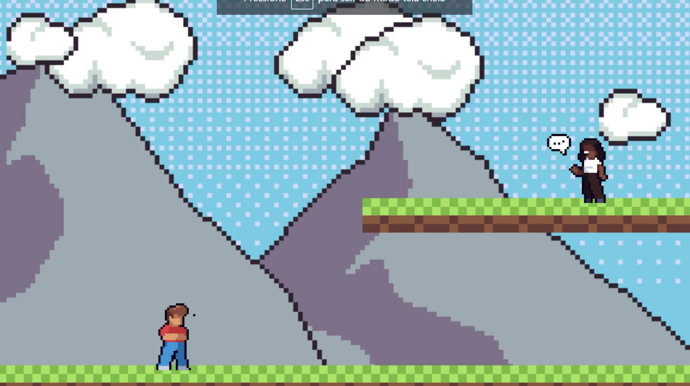
Fonte: Material produzido pelos autores (2024)

Figura 2 - Fase Inicial - Interação com NPC

Fonte: Material produzido pelos autores (2024)

## 4.2. Desenvolvimento básico do jogo (sprint 2)

&nbsp;&nbsp;&nbsp;&nbsp;Ao longo do desenvolvimento da versão básica do jogo, o grupo foi capaz de incluir novas mecânicas, novo design e mais fases. A figura 1 abaixo ilustra a tela de início funcional do jogo, que permite o acesso às demais funcionalidades. Em seguida, a figura 2 apresenta a tela de seleção de personagem criada, possibilitando maior diversidade ao representar o colaborador. A figura 3 ilustra o ambiente do Quarto, que contém as novas interações com itens e NPCs (Personagens Não-Jogáveis), como demonstradas na figura 4. Por fim, a figura 5 ilustra o novo cenário ao ar livre chamado Mundo Lúdico, que será intermediário ao longo do jogo.

Figura 1 - Tela de Início

Fonte: Material produzido pelos autores (2024)

Figura 2 - Seleção de Personagem

Fonte: Material produzido pelos autores (2024)

Figura 3 - Fase 1 - Quarto

Fonte: Material produzido pelos autores (2024)

Figura 4 - Fase 1 - Interação com NPC dentro do Quarto
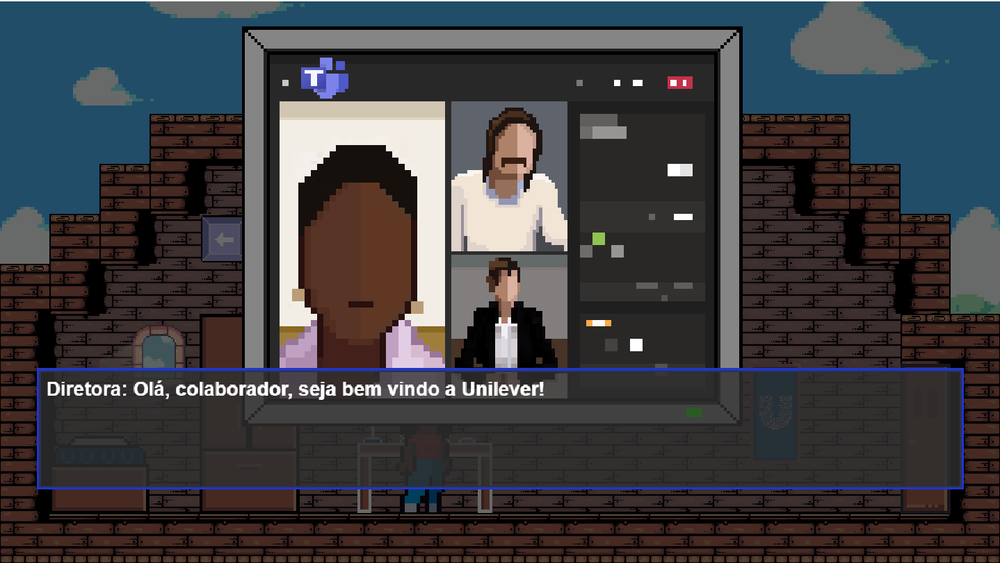
Fonte: Material produzido pelos autores (2024)

Figura 5 - Fase 2 - Mundo Lúdico

Fonte: Material produzido pelos autores (2024)

## 4.3. Desenvolvimento intermediário do jogo (sprint 3)

&nbsp;&nbsp;&nbsp;&nbsp;Em relação ao processo criativo para o desenvolvimento do jogo, foi um jornada de refinamento e aprimoramento constante. Analisamos as ideias e elementos anteriores, realizamos melhorias significativas para garantir a melhor experiência possível para os jogadores.

&nbsp;&nbsp;&nbsp;&nbsp;Optamos por manter o estilo de jogo 2D de plataforma e aventura em pixels, inspirado em jogos clássicos como Super Mario World, Mega Man e Sonic. Essa escolha foi resultado de uma análise das mecânicas de jogabilidade desses títulos e de como elas poderiam ser adaptadas e melhoradas para atender aos objetivos específicos do nosso jogo.

&nbsp;&nbsp;&nbsp;&nbsp;A escolha de manter um ambiente colorido, combinado com desafios ambientais, foi pensada na ideia de oferecer entretenimento e também uma jogabilidade que promova o aprendizado e o engajamento dos funcionários. Aprimorar a narrativa da Unilever, com a missão de recuperar as marcas roubadas pelos vilões, foi uma decisão estratégica para alinhar o jogo com os valores e objetivos da empresa, tornando-o relevante e significativo para o público-alvo.

&nbsp;&nbsp;&nbsp;&nbsp;Os controles simplificados e a jogabilidade intuitiva foram aprimorados após avaliar feedbacks e testes anteriores, visando oferecer uma experiência mais fluida e imersiva para os jogadores. Adicionamos elementos como power-ups, NPCs informativos e recompensas estrategicamente para enriquecer a experiência de jogo. 

&nbsp;&nbsp;&nbsp;&nbsp;Visualmente, o estilo pixel art e a trilha sonora foram refinados para criar uma atmosfera envolvente e atraente, garantindo uma imersão total no universo do jogo e fortalecendo a identidade visual e sonora do projeto.

&nbsp;&nbsp;&nbsp;&nbsp;Dessa forma, cada escolha e elemento do jogo para a Unilever foi analisado, melhorado e implementado após um processo de reflexão, resultando em uma experiência de jogo melhor e mais impactante para os jogadores.

Figura 1 - Fase 1 - Interação com NPC dentro do Quarto

Fonte: Material produzido pelos autores (2024)

&nbsp;&nbsp;&nbsp;&nbsp;Para a construção dos mapas do jogo, empregamos duas ferramentas essenciais: o Aseprite e o Tiled. No Aseprite, produzimos sprites de alta qualidade, incluindo personagens, objetos e elementos visuais do cenário. Em paralelo, o Tiled foi usado para montar os mapas de forma estruturada, com cada bloco configurado com o tamanho padrão de 64x64 pixels, proporcionando consistência visual e facilitando a organização dos elementos no ambiente de jogo.

&nbsp;&nbsp;&nbsp;&nbsp;Além disso, buscamos complementar a estética dos mapas com imagens do itch.io, que trouxeram detalhes e elementos visuais adicionais para enriquecer a experiência dos jogadores. Essa combinação de recursos e ferramentas resultou em ambientes gráficos detalhados, coesos e envolventes, garantindo uma jornada visualmente estimulante e imersiva ao explorar os diversos cenários do jogo.

&nbsp;&nbsp;&nbsp;&nbsp;Dentro do âmbito técnico, o jogo já possui grandes avanços. Antes mesmo da programação do jogo em si houve a criação de uma tela de pré-carregamento dedicada, garantindo uma modularidade do código, onde todos os preloads poderiam ser encontrados de uma vez só. Essa tela é essencial para carregar todos os recursos necessários, como imagens, áudios e outros ativos, otimizando assim o desempenho geral do jogo. 

Figura 2 - Página de preload - Exemplo de modularização do código
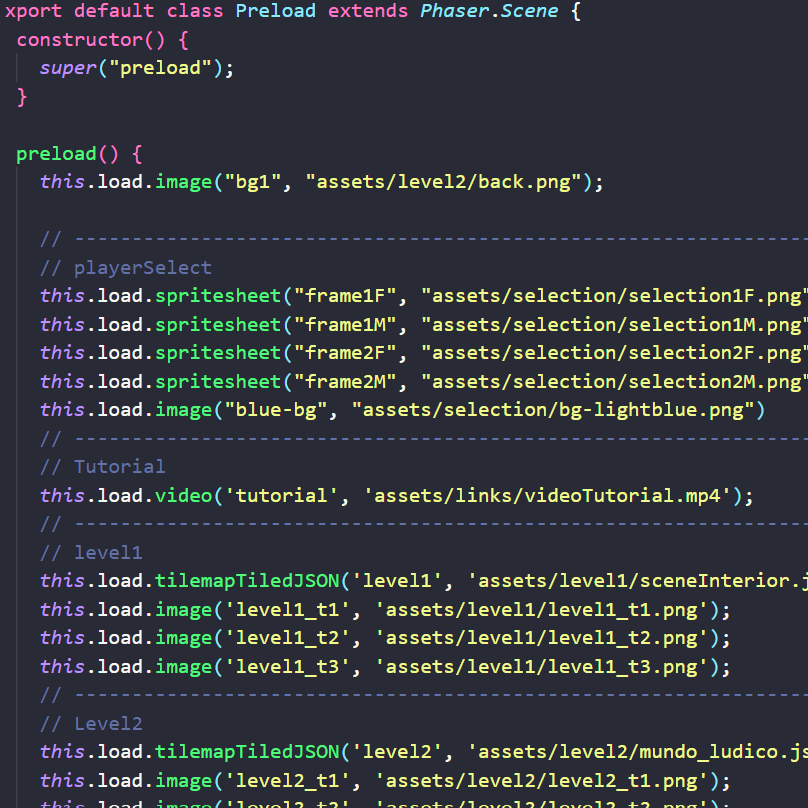
Fonte: Material produzido pelos autores (2024)

&nbsp;&nbsp;&nbsp;&nbsp;Em seguida, iniciamos o processo de confecção do jogo em si. Buscando referências externas, chegamos a conclusão que em jogos desse estilo, é natural trazer uma tela de título antes da jogatina, no intuito de induzir o jogador a querer iniciar o jogo, mas além disso, buscamos já imergir o jogador no estilo de arte pixelada que ele encontrará ao longo da aventura, e mergulhar os jogadores em uma atmosfera nostálgica desde o início. 

Figura 3 - Página de título - Apresentação inicial do game
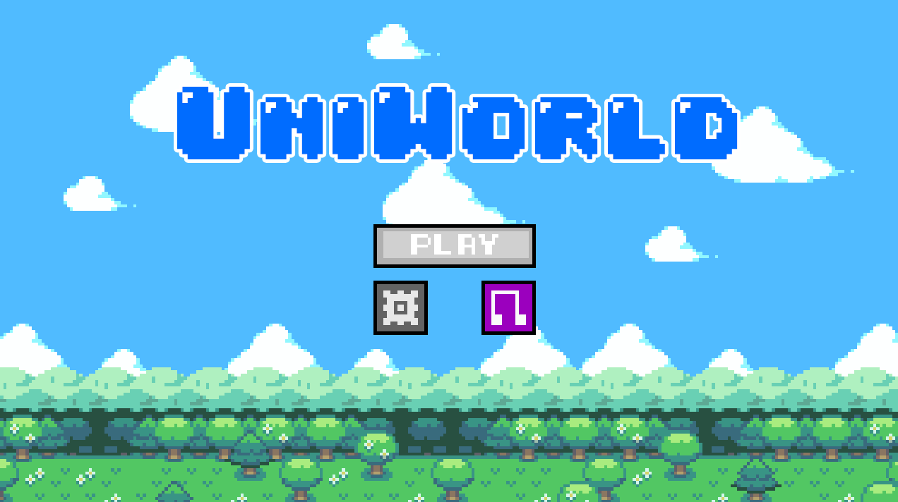
Fonte: Material produzido pelos autores (2024)

&nbsp;&nbsp;&nbsp;&nbsp;Para simplificar o gerenciamento das transições entre as diferentes cenas do jogo, fazemos uso da classe Phaser.Scene. Essa abordagem não só facilita a criação de ambientes de jogo coesos, mas também contribui para uma experiência de jogo mais organizada e envolvente. Ao tornar o botão "PLAY" interativo, com o auxílio dessa classe a transição para a próxima cena se torna eficiente e enxuta.

Figura 4 - Botão de PLAY - Interatividade e Comandos
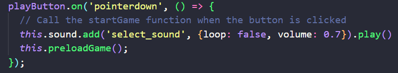
Fonte: Material produzido pelos autores (2024)

Figura 5 - Transição de Cena - Utilização do Phaser.Scene
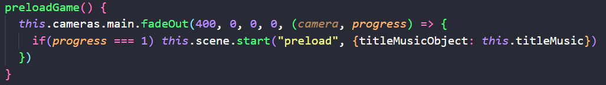
Fonte: Material produzido pelos autores (2024)

&nbsp;&nbsp;&nbsp;&nbsp;Dando um passo adiante na direção da inclusão e diversidade, foi encontrado em uma pesquisa de público alvo uma necessidade latente de englobar a diversidade dentro do jogo. Por conta disso, implementamos um sistema de seleção de personagens complexo. Os jogadores podem escolher entre quatro personagens diferentes, cada um com suas próprias características e aparências únicas. 

Figura 6 - Inclusão e Diversidade - Player select
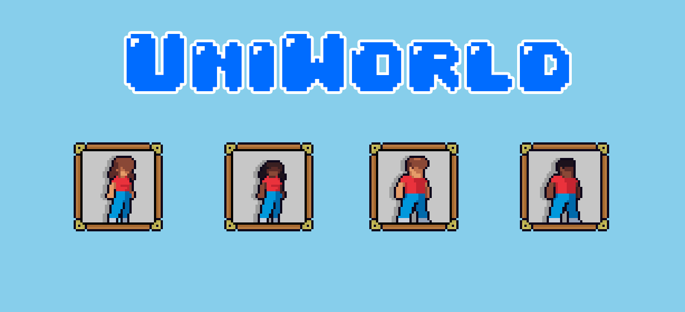
Fonte: Material produzido pelos autores (2024)

&nbsp;&nbsp;&nbsp;&nbsp;Quando o jogador interage com a tela da player select, o código reage de acordo com a seleção feita. Por exemplo, ao clicar em uma das quatro imagens dos personagens disponíveis, um evento de clique é acionado. Esse evento desencadeia uma função que atribui um número de ID ao personagem selecionado. Esse ID pode variar de 1 a 4, representando cada um dos quatro personagens.

&nbsp;&nbsp;&nbsp;&nbsp;A variável 'selectedPlayer' é então atualizada com o ID do personagem escolhido. Essa variável tem um papel crítico no controle das animações e spritesheets associadas ao personagem selecionado. Por exemplo, se o jogador selecionar o personagem com ID 2, a variável 'selectedPlayer' será definida como 2.

&nbsp;&nbsp;&nbsp;&nbsp;Essa informação é utilizada em uma função específica, como a 'initAnimations', que é responsável por carregar as animações corretas para o personagem escolhido. Isso é feito utilizando estruturas de decisão condicionais, como instruções if-else, que verificam o valor da variável 'selectedPlayer' e carregam as spritesheets e animações correspondentes.

Figura 7 - Trecho de código da Player Select - Números de ID
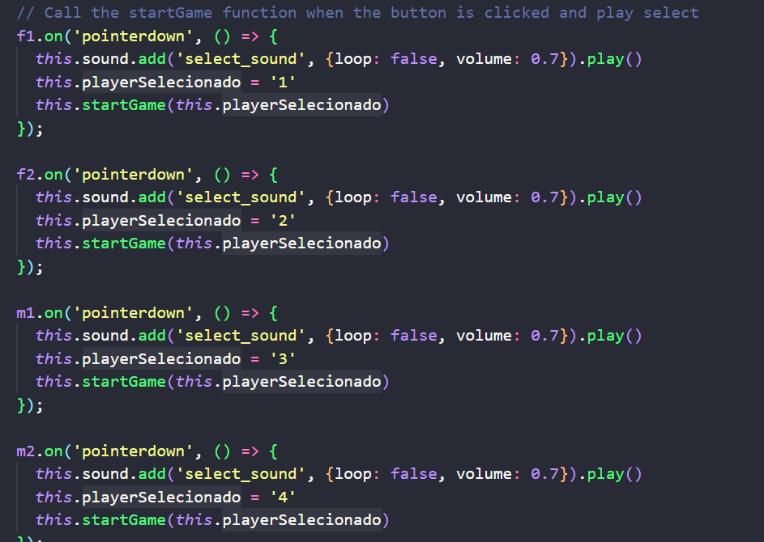
Fonte: Material produzido pelos autores (2024)

Figura 8 - Trecho de código da PlayerAnims - Infusão do ID para carregamento dos sprites desejados
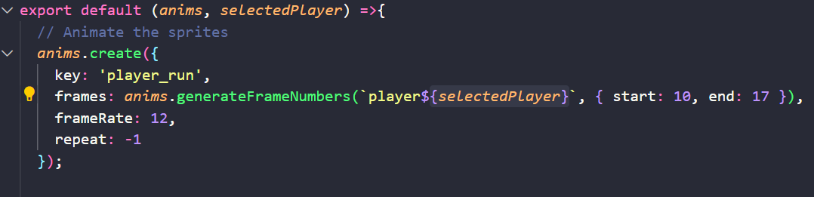
Fonte: Material produzido pelos autores (2024)

&nbsp;&nbsp;&nbsp;&nbsp;Na primeira cena de interação, os jogadores são introduzidos às mecânicas básicas do jogo. Aqui, eles aprendem sobre as habilidades de movimentação do personagem principal, incluindo movimento horizontal e vertical.

Figura 9 - Imagem do tutorial - Primeira cena de interação com o usuário
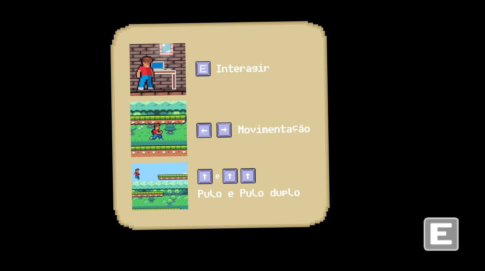
Fonte: Material produzido pelos autores (2024)

&nbsp;&nbsp;&nbsp;&nbsp;Para isso ser possível, foi feito um vídeo em formato de cutscene. Com o método do Phaser "create", o vídeo é adicionado na tela, fazendo com que pareça que uma imagem está se locomovendo.

Figura 10 - Trecho do código da TutorialScreen - criando a animação do vídeo/sub>
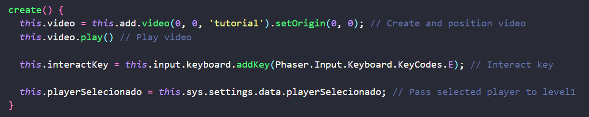
Fonte: Material produzido pelos autores (2024)

Ao adentrar a cena do quarto em nosso jogo, proporcionamos uma transição visual e narrativa fluida do tutorial anterior. Iniciamos com a tela escurecida da cena anterior gradualmente clareando, criando uma sensação de continuidade e imersão para o jogador. Assim que o ambiente se torna visível, o jogador se encontra diante de um computador. Esse elemento é destacado visualmente, com um brilho sutil ao redor, indicando sua interatividade. Uma prompt visual instrui o jogador a pressionar a tecla "E" para interagir.

Ao realizar essa interação, uma caixa de texto surge, introduzindo a história do jogo e delineando o objetivo principal do jogador: auxiliar na recuperação das marcas roubadas da Unilever. Essa abordagem não só envolve o jogador na narrativa, mas também fornece contexto para suas futuras ações no jogo.

Figura 11 - Imagem do Teams - player recebendo a missão 
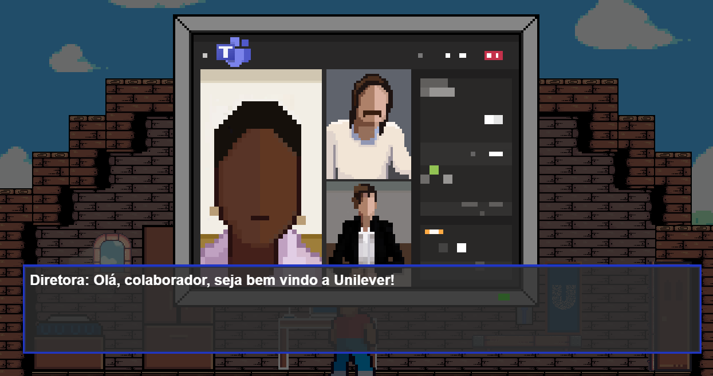
Fonte: Material produzido pelos autores (2024)

Após a interação inicial com o computador, o jogador percebe outro item colecionável na sala: um desodorante da marca Rexona. Novamente, um feedback visual e a instrução para pressionar "E" indicam a possibilidade de interação. Ao fazê-lo, o jogador é apresentado a um quiz que não apenas aprimora o envolvimento narrativo, mas também serve como um mecanismo para avaliar o conhecimento do jogador sobre informações relevantes à Unilever. Caso o jogador erre alguma pergunta, é oferecida a oportunidade de refazer o quiz para consolidar o aprendizado.

Ao coletar o item com sucesso, um feedback auditivo sutil confirma a ação do jogador, fornecendo uma resposta imediata e recompensadora. Além disso, a presença de uma trilha sonora de fundo, cuidadosamente selecionada para evocar conforto e familiaridade, contribui para estabelecer uma atmosfera acolhedora e imersiva na cena do quarto.

Cada elemento nessa etapa foi projetado com o objetivo de envolver o jogador na narrativa, oferecer feedback claro e criar uma experiência de jogo coesa e agradável. Ao integrar sons e interações visuais significativas, buscamos garantir que o jogador se sinta imerso no universo do jogo e motivado a prosseguir em sua jornada de aprendizado e exploração.

&nbsp;&nbsp;&nbsp;&nbsp;Em seguida à cena do menu e do quarto, o jogador embarca na aventura no "Mundo Lúdico", o primeiro mapa do jogo. Neste cenário encantador, concebemos uma experiência imersiva que desafia o jogador a superar obstáculos e derrotar inimigos enquanto explora um ambiente vibrante e cheio de vida.

Figura 12 - Inclusão e Diversidade - Player select

Fonte: Material produzido pelos autores (2024)

&nbsp;&nbsp;&nbsp;&nbsp;Uma das mecânicas mais importantes do jogo é a movimentação e o pulo duplo. A movimentação é controlada pelas teclas direcionais do teclado ou pelas teclas A, W e D. Já o pulo duplo adiciona uma camada adicional de complexidade à jogabilidade, permitindo que os jogadores realizem até dois pulos consecutivos. Uma imagem que demonstre a movimentação do personagem e a mecânica do pulo duplo seria ideal para elucidar este ponto. [Inserir captura de tela da movimentação do personagem e do pulo duplo]

&nbsp;&nbsp;&nbsp;&nbsp;O objetivo ao criar o Mapa 1 foi introduzir os jogadores ao universo do jogo de forma cativante e envolvente. Para alcançar esse objetivo, optamos por um ambiente lúdico e inspirador, onde o jogador se sentiria motivado a explorar e progredir. A música de aventura selecionada foi cuidadosamente escolhida para instigar entusiasmo e um senso de desafio no jogador, complementando a atmosfera de exploração.

&nbsp;&nbsp;&nbsp;&nbsp;Decidimos incluir diversas decorações temáticas, como placas com o símbolo da Unilever, um avião e um balão com o logo de uma das empresas da Unilever: Dove. Esses elementos não apenas reforçam a identidade da marca, mas também criam uma conexão entre o jogo e o contexto do processo de onboarding dos novos funcionários de TI na Unilever: se conectar com a empresa, seus valores e marcas.

Figura 13 - Trecho código - level 2 
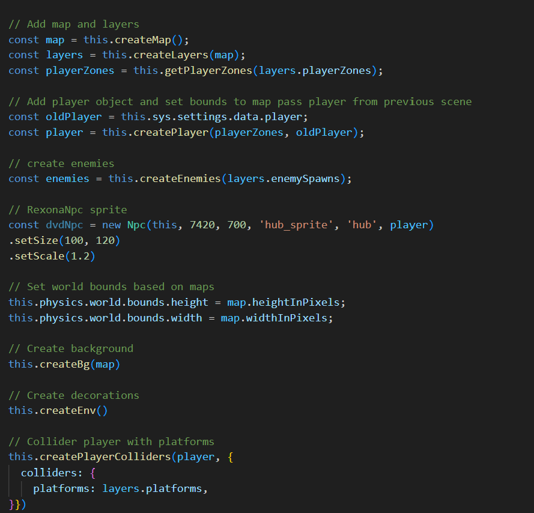
Fonte: Material produzido pelos autores (2024)

&nbsp;&nbsp;&nbsp;&nbsp;A presença da casinha de decoração, que representa o quarto de onde o jogador sai, adiciona um toque de continuidade entre as cenas anteriores e o nível atual. Os inimigos deste nível, como os slimes, foram escolhidos para fazer alusão à lama e ao piche, complementando o tema da floresta utilizado no “Mundo Lúdico” do nosso jogo.

&nbsp;&nbsp;&nbsp;&nbsp;Por fim, o chefe deste mapa, a "Árvore do Mal", simboliza os desafios enfrentados pela empresa em relação à preservação ambiental. Derrotar este chefe requer habilidade e estratégia, proporcionando uma experiência desafiadora e gratificante para o jogador.

&nbsp;&nbsp;&nbsp;&nbsp;No segundo mapa do jogo, transportamos o jogador da atmosfera lúdica do Mundo Lúdico para a Cidade Unilever. Neste cenário urbano, o jogador é confrontado outra questão do mundo real, a poluição.

&nbsp;&nbsp;&nbsp;&nbsp;O objetivo ao criar o Mapa 2 foi oferecer uma continuidade narrativa à história do jogo, enquanto exploramos temas relevantes para a Unilever. Optamos por incluir prédios temáticos com marcas da Unilever, como uma forma de inserir elementos do cotidiano dos funcionários da empresa no contexto do jogo. Além de funcionar como uma forma de conectar os usuários à empresa.

&nbsp;&nbsp;&nbsp;&nbsp;Assim como no primeiro mapa, este também apresenta plataformas, inimigos e um chefe final desafiador. O chefe deste mapa, a representação de uma "Mão de Poluição", representa os desafios ambientais e a responsabilidade corporativa da Unilever em lidar com questões de sustentabilidade e poluição.

&nbsp;&nbsp;&nbsp;&nbsp;Adicionalmente, incluímos um inimigo fácil, a "Fumaça", que persegue o jogador durante a fase, conectando-se ao enredo e reforçando a temática da poluição e impacto ambiental.

&nbsp;&nbsp;&nbsp;&nbsp;Com as bases do jogo estabelecidas neste estágio intermediário de desenvolvimento, estamos prontos para avançar para etapas mais avançadas, incluindo a expansão das mecânicas, a introdução de desafios adicionais e o refinamento geral da experiência do jogador.

Figura 14 - Inimigo - Fumaça 
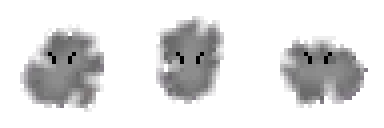
Fonte: Material produzido pelos autores (2024)

## 4.4. Desenvolvimento final do MVP (sprint 4)

*Descreva e ilustre aqui o desenvolvimento da versão final do jogo, explicando brevemente o que foi entregue em termos de MVP. Utilize prints de tela para ilustrar. Indique as eventuais dificuldades e planos futuros.*

## 4.5. Revisão do MVP (sprint 5)

*Descreva e ilustre aqui o desenvolvimento dos refinamentos e revisões da versão final do jogo, explicando brevemente o que foi entregue em termos de MVP. Utilize prints de tela para ilustrar.*

# 5. Testes (sprint 4)

## 5.1. Casos de Teste

&nbsp;&nbsp;&nbsp;&nbsp;Primeiramente, os casos de testes são fundamentais para validar a procedência do jogo, garantindo que o mesmo funcione corretamente e evitando que os jogadores encontrem bugs e erros durante a experiência de jogo. Em outras palavras, realizamos testes com o objetivo de confirmar a funcionalidade do jogo.

&nbsp;&nbsp;&nbsp;&nbsp;Nesse sentido, conduzimos esses testes com a participação de jovens, incluindo nós mesmos, com idades entre 18 e 20 anos. As avaliações foram realizadas no período de fevereiro a março de 2024. A seguir, apresentamos os resultados desses testes

\# | pré-condição do teste | o que ocorre no teste | resultado esperado do teste
--- | --- | --- | --- 
1 | Abrir tela inicial do jogo | Clicar no botão “play” | Iniciar cena 1
2 | Abrir tela inicial do jogo | Clicar no botão “som” | Silenciar som do jogo
3 | Posicionar personagem em frente ao notebook | Apertar tecla de interação com o notebook | Abrir diálogo na plataforma teams
4 | Posicionar o personagem em frente ao Rexona | Apertar tecla de interação com o Rexona | Pegar o item Rexona
5 | Posicionar o personagem em frente à porta do quarto | Passar pela porta do quarto | Encerrar cena e Iniciar cena 2
6 | Entrar no jogo | Apertar “E” na frente do NPC | Interagir com o  NPC
7 | Entrar no jogo | Apertar várias vezes o botão “E” na frente do npc   | O jogo não bugar
8 | Entrar no jogo | Apertar ‘E” com coletáveis   | Coletar o item
9 | Entrar no jogo | Alguém, que nunca jogou o jogo, vai passar todo o jogo | Conseguir finalizar 
10 | Entrar no jogo | Alguém, que nunca jogou o jogo, enfrentar os inimigos fáceis | Conseguir finalizar
11 | Entrar no jogo | Alguém, que nunca jogou, enfrentar o boss | Conseguir matá-lo
12 | Entrar no jogo | Pular,correr,ficar parado | Movimentação fluida das sprites 
13 | Entrar no menu  | Ativar e desativar o  som | O som parar (ao clicar em desativar) e voltar (ao clicar em ativar)  
14 | Entrar na seleção de personagem |  Selecionar personagem | O jogo iniciar com o personagem selecionado 

 

## 5.2. Testes de jogabilidade (playtests) (sprint 4)

### 5.2.1 Registros de testes

*Descreva nesta seção as sessões de teste/entrevista com diferentes jogadores. Registre cada teste conforme o template a seguir.*

Nome | João Jonas (use nomes fictícios)
--- | ---
Já possuía experiência prévia com games? | sim, é um jogador casual
Conseguiu iniciar o jogo? | sim
Entendeu as regras e mecânicas do jogo? | entendeu as regras, mas sobre as mecânicas, apenas as essenciais, não explorou os comandos complexos
Conseguiu progredir no jogo? | sim, sem dificuldades  
Apresentou dificuldades? | Não, conseguiu jogar com facilidade e afirmou ser fácil
Que nota deu ao jogo? | 9.0
O que gostou no jogo? | Gostou  de como o jogo vai ficando mais difícil ao longo do tempo sem deixar de ser divertido
O que poderia melhorar no jogo? | A responsividade do personagem aos controles, disse que havia um pouco de atraso desde o momento do comando até a resposta do personagem

### 5.2.2 Melhorias

*Descreva nesta seção um plano de melhorias sobre o jogo, com base nos resultados dos testes de jogabilidade*

# 6. Conclusões e trabalhos futuros (sprint 5)

*Escreva de que formas a solução do jogo atingiu os objetivos descritos na seção 1 deste documento. Indique pontos fortes e pontos a melhorar de maneira geral.*

*Relacione os pontos de melhorias evidenciados nos testes com plano de ações para serem implementadas no jogo. O grupo não precisa implementá-las, pode deixar registrado aqui o plano para futuros desenvolvimentos.*

*Relacione também quaisquer ideias que o grupo tenha para melhorias futuras*

# 7. Referências (sprint 5)

_Incluir as principais referências de seu projeto, para que seu parceiro possa consultar caso ele se interessar em aprofundar. Um exemplo de referência de livro e de site:_ 

LUCK, Heloisa. Liderança em gestão escolar. 4. ed. Petrópolis: Vozes, 2010.  
SOBRENOME, Nome. Título do livro: subtítulo do livro. Edição. Cidade de publicação: Nome da editora, Ano de publicação.  

INTELI. Adalove. Disponível em: https://adalove.inteli.edu.br/feed. Acesso em: 1 out. 2023  
SOBRENOME, Nome. Título do site. Disponível em: link do site. Acesso em: Dia Mês Ano

# Anexos

*Inclua aqui quaisquer complementos para seu projeto, como diagramas, imagens, tabelas etc. Organize em sub-tópicos utilizando headings menores (use ## ou ### para isso)*
